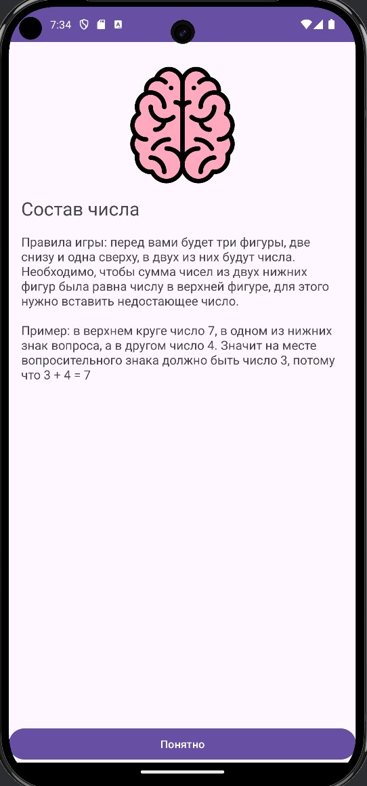
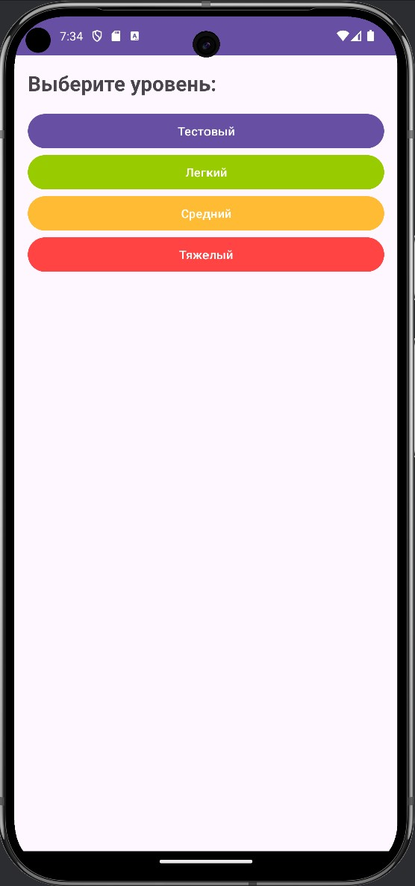
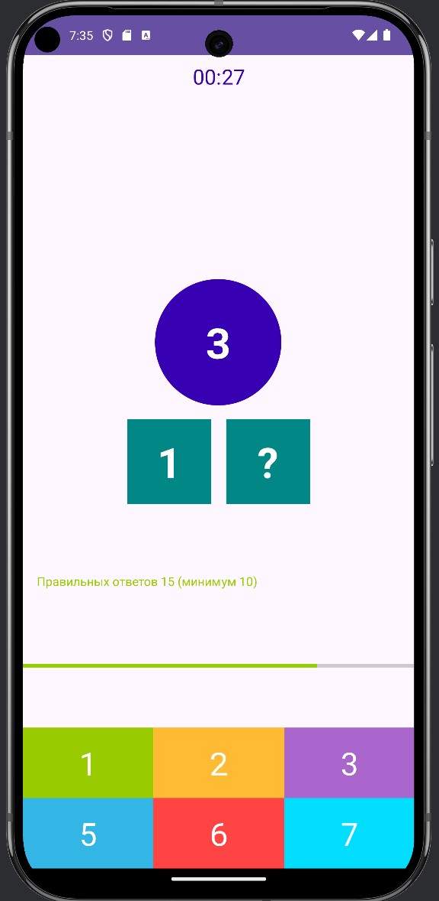
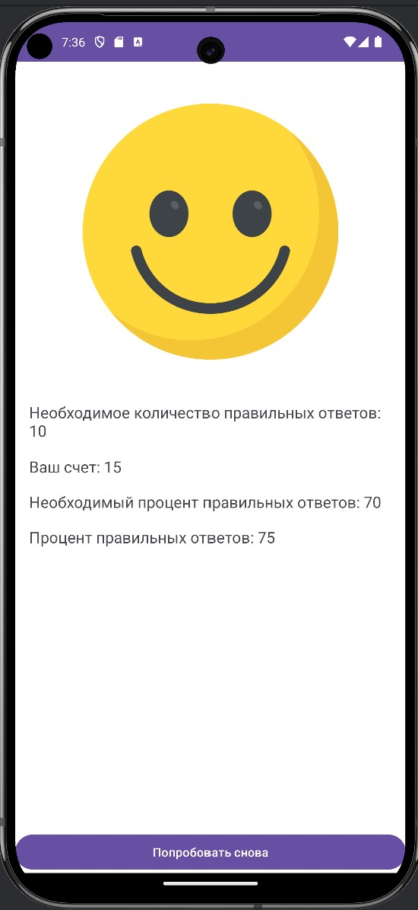
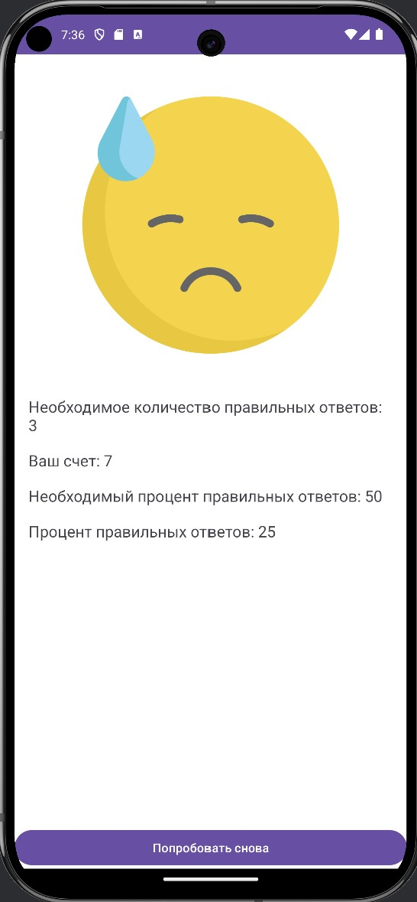

# Composition Number

## Overview
This is a small android project in the Kotlin language, which has 3 levels (easy, medium and hard). The application is aimed at solving simple examples.

## Features
- 3 difficulty levels.
- Results immediately after completing the level

## Tech Stack
| **Category**             | **Technologies**                  |
|--------------------------|-----------------------------------|
| **Language**             | Kotlin                            |
| **Architecture**         | Clean Architecture                |
| **Reactive Programming** | LiveData                          |
| **UI**                   | Fragment Navigation               |

## Screenshots

